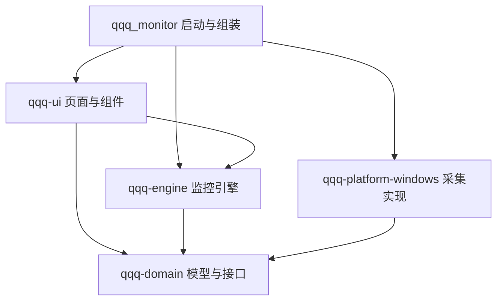
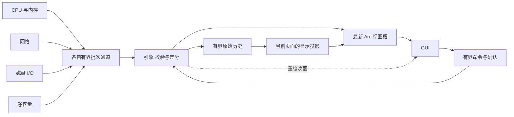

# qqq_monitor 架构设计

本项目已建立一个 Cargo Workspace、四个库 crate 和一个启动包。领域模型与引擎不依赖 Windows 或 GUI；具体采集器由启动入口注入，页面只使用不可变监控视图。本文说明当前实现、扩展契约与已知边界，范围和验收目标分别见 [技术方案](TECHNICAL_PLAN.md) 与 [实施与验收计划](IMPLEMENTATION_PLAN.md)。

## 模块和依赖方向



箭头表示编译依赖。四个库对应不同变化原因：系统接口变化只影响平台层，指标语义变化进入领域层，调度与历史策略归引擎，布局和交互归 GUI。无需新增动态插件、数据库、系统服务或异步运行时即可扩展内置功能。

| 模块 | 当前职责 | 对外接口 |
| --- | --- | --- |
| `qqq-domain` | 设备、指标、单位、读数状态、采集工厂 | `Collector`、`CollectorFactory` 和模型 |
| `qqq-platform-windows` | sysinfo、IP Helper、PDH、卷 GUID、原生句柄 RAII | `collectors()`、安全的启动错误提示 |
| `qqq-engine` | 采样调度、差分、历史、查询投影、配置、命令确认 | `MonitorRuntime`、`MonitorClient`、`MonitorView`、`ConfigStore` |
| `qqq-ui` | 六个独立页面、图表、设备选择、主题、中文字体 | `DesktopApp`、`Page`、截图选项 |
| 根包 | 日志、组装、DX12 窗口、CLI 冒烟和关闭 | Windows EXE |

领域、引擎、GUI 和启动包禁止 `unsafe`。Windows 必要的 FFI 集中在 `native.rs`，说明每个调用的句柄、缓冲区和生命周期条件；调用方只看到安全接口。

## 当前目录

```text
qqq_monitor/
├── Cargo.toml                       # Workspace、依赖和 Rust 版本
├── Cargo.lock
├── src/
│   ├── main.rs                      # GUI、冒烟、截图、关闭
│   └── bootstrap.rs                 # 日志初始化
├── crates/
│   ├── qqq-domain/src/
│   │   ├── lib.rs
│   │   ├── metric.rs                # 指标键、单位、采样和状态
│   │   ├── device.rs                # 身份、类型、在线状态、详情
│   │   └── collector.rs             # 工厂、周期、批次和错误
│   ├── qqq-platform-windows/src/
│   │   ├── lib.rs                   # 内置工厂注册
│   │   ├── cpu_memory.rs            # 持久 System 实例
│   │   ├── network.rs               # 网卡计数与身份
│   │   ├── disk_io.rs               # 物理磁盘 PDH 读写
│   │   ├── inventory.rs             # 本地卷发现与容量
│   │   └── native.rs                # IP Helper、PDH、卷 API 和 RAII
│   ├── qqq-engine/
│   │   ├── src/
│   │   │   ├── lib.rs
│   │   │   ├── runtime.rs           # 线程、命令、退出与故障隔离
│   │   │   ├── normalize.rs         # 实际时间差、预热与数据验证
│   │   │   ├── history.rs           # 有界历史和显示投影
│   │   │   ├── view.rs              # 不可变 GUI 无关视图
│   │   │   └── config.rs            # 校验、恢复和后台保存
│   │   └── tests/runtime_flow.rs    # 可控假采集器的运行时测试
│   └── qqq-ui/
│       ├── assets/fonts/            # Noto Sans CJK SC 和 OFL 许可
│       └── src/
│           ├── lib.rs
│           ├── app.rs               # 导航、查询、UI 状态和生命周期
│           ├── theme.rs             # 配色、字体、控件和卡片
│           ├── components.rs        # 格式、图表、状态、设备选择
│           └── pages/
│               ├── mod.rs
│               ├── overview.rs
│               ├── cpu.rs
│               ├── memory.rs
│               ├── disk.rs
│               ├── network.rs
│               └── settings.rs
└── docs/
    ├── TECHNICAL_PLAN.md
    ├── ARCHITECTURE.md
    ├── IMPLEMENTATION_PLAN.md
    └── VALIDATION.md
```

调度、命令与客户端暂集中在 `runtime.rs`，历史与投影集中在 `history.rs`；继续增长时可在原 crate 内拆分普通模块。页面已独立分文件，页面模块是 `app` 的内部子模块，可以访问必要的 UI 状态，无需将状态字段暴露为公共 API。

## 设备和指标契约

`DeviceDescriptor` 包含会话 ID、可选的跨启动身份 persistent_id、类型、名称、在线状态和详情。主键以身份而非名称构建：`cpu`、`core:索引`、`memory`、`system`、`disk:设备号`、`volume:卷GUID`、`net:LUID`。物理磁盘设备号与 LUID 用于本次会话；网卡选择保存接口 GUID，启动后重新解析为本次 LUID。

`MetricKey` 由设备 ID 和指标名组成，例如 `(cpu, usage)`、`(memory, available)`、`(disk:0, read)`、`(net:LUID, receive)`。`MetricDescriptor` 声明单位；`MetricSample` 额外包含真实单调时间和 `SampleValue`：

- `Gauge(f64)` 是已经归一化的值，包括 CPU 百分比、容量和 PDH 格式化 B/s。
- `Counter(u64)` 是累计计数；当前用于网络字节，由引擎计算速率。
- `WarmingUp`、`Unsupported`、`Failed` 保留状态与原因，不能用零代替。

引擎检查单位一致、采样时刻不倒退，以及同一个指标键不被两个采集源覆盖。百分比要求 0 至 100；所有 Gauge 要求非负且有限。合法零流量仍为有效数据。

`MetricReading` 保存当前值、会话字节、状态、失败原因、最后成功时刻、最后尝试时刻和周期。无效采样保留上次成功值，但卡片和图表标注其状态和数据年龄。状态包括 `WarmingUp`、`Ready`、`Stale`、`Unsupported`、`Failed`、`Offline`；过期阈值为 `max(3 × 周期, 3 秒)`，30 秒容量指标不会在 3 秒后过期。

卷容量与物理磁盘 I/O 保持独立。当前未实现卷到物理磁盘的多对多映射，不把 I/O 硬套到盘符，也不加总虚拟网卡与物理网卡的流量。

## 采集接口

当前公共接口如下，完整定义见领域 crate：

```rust
pub trait Collector {
    fn collect(&mut self, context: &CollectContext)
        -> Result<SampleBatch, CollectorError>;
}

pub trait CollectorFactory: Send + Sync {
    fn descriptor(&self) -> CollectorDescriptor;
    fn create(&self) -> Result<Box<dyn Collector>, CollectorError>;
}
```

`CollectorDescriptor` 包含稳定的采集源 ID 和 `SamplingPeriod`：跟随用户配置或固定周期。工厂跨线程，Collector 本身不要求 `Send`。实际采集对象在所属线程创建、使用和销毁，避免跨线程移动 PDH 句柄等线程相关资源；初始化由工厂完成，释放由 RAII 完成。

`SampleBatch` 提供设备、采样、开始和结束时间，以及 `complete_inventory` 标志。只有权威完整目录才能把缺席设备标记离线；预热期间返回空的部分批次不会误删设备。单指标失败进入该指标的 SampleValue，采集源整体失败返回 Result 错误并触发退避。

## 线程和数据流

| 执行位置 | 内容 | 周期 |
| --- | --- | --- |
| GUI 主线程 | eframe 布局、输入和渲染 | 输入、状态变化或快照唤醒 |
| 引擎线程 | 归一化、历史、投影和命令 | 每轮最多等待 25 ms，空闲时至少每秒发布 |
| CPU/内存线程 | 复用 sysinfo System | 0.5、1 或 2 秒 |
| 网络线程 | GetIfTable2 字节、身份和状态 | 跟随采样间隔；目录随批次更新 |
| 磁盘线程 | 持久 PDH 查询和实例数组 | 跟随采样间隔 |
| 卷线程 | 发现本地卷并刷新容量 | 30 秒，支持手动提前刷新 |
| 配置写线程 | UTF-8 TOML 临时写入与替换 | 有待保存配置时写入；空闲轮询 20 ms |

CPU/内存与网络使用独立线程，使网络 API 变慢也不会拖延 CPU 更新。sysinfo 未启用内部 multithread feature。设备目录直接随网络和磁盘采样更新，首版不再额外维护一个 10 秒的身份发现线程。



历史和投影在锁外构造，共享锁只替换 Arc。GUI 用 `try_latest_view` 非阻塞克隆最新 Arc，取不到时保留当前视图；不会读取 sysinfo、Win32 或可变历史。引擎调用注入的线程安全回调请求重绘，自身不依赖 egui。

eframe 的 `logic` 消费视图、命令结果和退出事件；`ui` 只绘制页面并提交查询。窗口停止绘制不影响后台历史。未设置连续 60 FPS 装饰动画，最小化降频和恢复体验仍列入人工验收。

## 背压和采样时序

| 数据 | 上限 | 满载策略 |
| --- | --- | --- |
| 每个采集源批次 | 8 批 | try_send 丢弃当前批次，累计丢批；后续批次携带该计数 |
| 最新 UI 视图 | 1 个 Arc 槽 | 替换旧视图，不排队显示快照 |
| 在途命令 | 32 个 | 立即返回繁忙；消费结果后释放名额 |
| 命令结果 | 32 个 | 在途名额包含未消费结果，保证正常运行时每个接受请求有结果 |
| 配置待保存 | 1 个 | 保留最新配置；被合并请求收到 Superseded |

引擎按限额轮询各源，避免单一采集源饿死命令和其他源。丢批之后插入历史缺口，清除该来源速率基线，不能用平滑曲线隐藏丢失。

调度使用 Instant 和截止点推进；落后多个周期时跳过旧任务，避免密集补跑。网络速率按实际经过时间求差；第一轮、回退、失败后恢复、丢批或超过三倍周期时重新预热。CPU 和 PDH 同样在首次或长间隔后先预热。异常长间隔用于识别可能的睡眠恢复，但完整的 Windows 电源事件和睡眠场景尚未验收。

## 历史与内存约束

原始历史只有引擎能写，按 MetricKey 保存 VecDeque。最长 900 秒、每序列最多 1801 点，全局历史预算 16 MiB；超出预算时按最老序列分批裁剪并收缩容量。计费包含 deque 分配容量、键字符串容量和条目结构，属于历史存储的近似预算，不包含 BTreeMap 节点分配器开销、GUI Arc 或图形资源。

当前查询最多 16 条序列，每条投影最多 400 点，GUI 各页面实际请求不超过 6 条。降采样保持峰谷时间顺序；混合有效值和缺口的桶保守保留缺口，避免画出跨越故障的连线，可能舍弃同桶部分有效细节。投影不覆盖原始数据，也不在每帧复制全部历史。

CPU 核心网格使用最新读数，点击核心后才请求其历史。离线设备及相关指标在历史过期后清理，名称变化不会生成第二套身份。

## GUI 状态和配置

主线程持有页面、所选设备、历史范围、设置草稿和当前已接受配置。`MonitorView` 提供指标、目录、投影、诊断和保存状态；`MonitorClient` 提供非阻塞取视图、提交命令、消费结果和注入唤醒。

设置采用“应用并保存”：校验后先改变引擎采样周期，再由后台保存。保存失败显示“设置已应用，但未保存”。选择网卡只保存当前已接受配置和接口 GUID，不顺带提交设置页面尚未应用的草稿；正常关闭保存已接受配置与窗口几何信息。

配置按字段恢复类型或范围错误，语法损坏时保留原文件并提示。未经用户主动保存，不自动替换损坏文件。保存使用同目录临时文件、UTF-8、sync_all、关闭句柄、rename 替换；失败不先删除旧配置，只清理本次临时文件。

GUI 复用指标卡片、历史图表、状态和设备选择组件；六个页面在独立文件维护。主题、格式和中文字体集中管理，容量、速率和时间显示不改变指标口径。

## 生命周期和故障隔离

启动入口先初始化日志、读取配置和组装工厂，再启动引擎和 GUI；扫描在后台完成。DX12 启动失败会记录错误并弹原生消息框；冒烟和截图模式只输出错误，便于自动检查。

每个采集源的创建与采集被 catch_unwind 隔离，失败按 1、2、4、8、16、30 秒退避并重建对象，其他源继续工作。尚未返回的同步 API 不触发并行替代线程；数据由最后成功时刻变为过期。错误恢复不等于可以恢复 FFI 未定义行为，原生缓冲区和句柄仍需独立审查。

关闭通过独立原子取消信号唤醒等待者，不依赖可能已满的命令通道。引擎处理已接受命令后通知配置线程完成最后保存。统一等待最多 2 秒，已经结束的线程 join；同步 API 仍阻塞的线程记录警告并脱离等待，最终由进程退出回收。不能承诺强制中断 Win32，也不能声称超时的保存已经完成。

日志按日滚动并最多保留 7 个文件；日志目录不可写时回退 stderr。20 MiB 总量硬限制、采集耗时 p95 和详细调度延迟诊断尚未实现，不作为已交付能力。

## 扩展方式

1. **新增指标**：领域层增加必要单位或设备类型；平台实现 CollectorFactory，平台注册并交给引擎；页面通过 MetricKey 读取和查询。引擎无需识别具体采集器名称。温度、GPU 和厂商 SDK 应各自独立采集，缺少能力只影响对应指标。
2. **新增页面**：在 pages 增加文件与 Page 路由，组合公共组件；在 app 的 query 中声明需要的指标。页面无需依赖 Windows API。
3. **告警与导出**：告警放在归一化之后，规则包含持续时间、恢复阈值和去抖；导出通过引擎查询有缺口的数据区间，再交后台 I/O。需要长期存储时才增加持久化接口。
4. **进程管理**：领域层增加 PID 与创建时间组成的实例标识及只读/控制接口；控制操作作为命令而非 Collector，操作前验证实例仍匹配，再按需申请权限。
5. **新平台**：另增平台 crate 并由启动入口选择；本轮不承诺跨平台可运行。第三方动态插件若有实际需求，再设计稳定 C ABI 或进程间协议，不跨 DLL 暴露 Rust trait object。

## 验证边界

已有测试覆盖实际时间差、计数回退、Gauge 速率、合法零值、失败恢复、各周期过期、历史时间/点数/预算、投影缺口、慢采集隔离、在途命令上限、关闭保存和损坏配置保护。真实 Windows 采集与六页面截图由 CLI 验证，完整结果见 [实现验证记录](VALIDATION.md)。

还需验证通道真实溢出、设备消失后的清理、连续保存合并和写入失败、睡眠恢复、热插拔、键盘交互、多屏缩放及长期资源预算。构建成功和截图可读不能代替这些验收。
